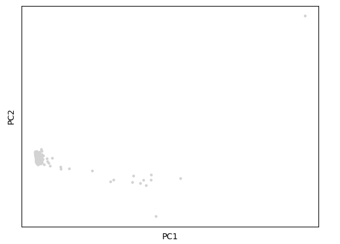

# PCA in Single-Cell Analysis with Scanpy

One of the first steps in genomic data analysis, especially in single-cell analysis is **dimensionality reduction**.

Hundreds (or thousands) of cells with expression values for thousands of genes can be an overwhelming space to extract meaningful patterns from.

Let’s walk through the core idea behind dimensionality reduction using one of the most popular approaches: **PCA** using Scanpy.

---

## What Is Scanpy?

> _“Scanpy is a scalable toolkit for analyzing single-cell gene expression data.”_

It’s widely used in the single-cell world, and one of the very first steps **after cleaning and quality control** is running PCA.

---

## What is PCA?

**PCA** stands for **Principal Component Analysis**. It’s a technique that transforms large datasets into a new coordinate system, where:

- Each new axis, called a **principal component**, captures variation in the data.
- The first component (**PC1**) captures the most variance.
- Each following component (PC2, PC3, etc.) captures as much remaining variance as possible, while being **uncorrelated** to the others.

In single-cell analysis:

- PCA helps reduce the number of dimensions from thousands of genes to 10–50 components.
- These components are then used for further downstream analysis and Visualizations.

You can think of PCA as creating a **“Z space”**, a new space where each axis (Z1, Z2, ...) captures maximum variance as a **linear combination of genes**.

---

Let’s simplify with an example.

Say you run PCA and plot **PC1 vs PC2**:

- **PC1** is the direction in which your data shows the most variation. Biologically, this might reflect **phenotype**, **cell type**, or **batch effects** — it depends on the dataset.
- The **clusters** you see may correspond to different cell types, disease states, or other biological patterns.
- **BUT:** not every PC will carry biologically meaningful information. Sometimes later PCs capture just noise or technical variation.

> And the best part? You don’t need to understand the math to **use it effectively**.

---

## How Scanpy Runs PCA

Here’s a simple [Scanpy](https://scanpy.readthedocs.io/en/stable/index.html) PCA pipeline using the [PBMC 3k dataset](https://scanpy.readthedocs.io/en/stable/generated/scanpy.datasets.pbmc3k.html) a freely anaiable dataset from 10x Genomics.

```python
import scanpy as sc

adata = sc.datasets.pbmc3k()

sc.pp.normalize_total(adata)     # Normalize counts per cell (e.g., to 10,000)
sc.pp.log1p(adata)               # Log-transform the data
sc.pp.highly_variable_genes(adata, keep=True)  # Pick top variable genes
adata = adata[:, adata.var.highly_variable]    # Subset to just those genes
sc.pp.scale(adata)              # Standardize each gene (mean=0, variance=1)
sc.tl.pca(adata)                # Run PCA
sc.pl.pca(adata)                # Plot PC1 vs PC2

```
### What’s happening in each step?

|Step|Description|
|---|---|
|`normalize_total`|Ensures all cells have the same total counts|
|`log1p`|Log-transforms the expression to reduce skew|
|`highly_variable_genes`|Keeps genes that vary the most across cells|
|`scale`|Standardizes each gene to mean 0, variance 1|
|`tl.pca`|Runs PCA using scikit-learn under the hood|
|`pl.pca`|Plots PC1 vs PC2 for visualization|

---

### Where is the output stored?

Scanpy stores PCA results directly in the AnnData object:

- `adata.obsm['X_pca']`: PCA coordinates for each cell
    
- `adata.varm['PCs']`: Gene loadings for each principal component
    
- `adata.uns['pca']`: Variance explained by each PC
    

|Attribute|Shape|Meaning|
|---|---|---|
|`adata.X`|(2700, 1000)|Expression matrix: cells × genes|
|`adata.obsm['X_pca']`|(2700, 50)|Cell embeddings in PCA space|
|`adata.varm['PCs']`|(1000, 50)|Gene loadings (contribution to PCs)|
|`adata.uns['pca']['variance_ratio']`|(50,)|Variance explained by each PC|

---

### A Note About PC1

In the PC1 vs PC2 plot for the PBMC dataset, we observe that **PC1 appears to reflect technical variation**. When colored by `n_counts`, `n_genes_by_counts`, and `percent_mito`, we notice:


One outlier cell with **very high `n_counts`**, but **low gene diversity and low mitochondrial content**.

This suggests PC1 might be dominated by **technical factors** (like a few genes expressed at very high levels) rather than biological identity. So:  
**Always inspect your PCs !!
Not all are biologically meaningful.**

---

## 📊 How Many PCs Should I Use?

To visualize how much variance each PC explains:

`sc.pl.pca_variance_ratio(adata, log=True)`

This generates a **variance ratio plot**, where:

- Y-axis shows how much variance each PC explains
    
- X-axis ranks the PCs
    
- Look for the **“elbow”**: where the variance drops off
    
- For this dataset, around **10 PCs** appear to carry most of the meaningful variation


PCA is one of those magical tools that make messy, high-dimensional biological data understandable.

Whether you’re clustering neurons, identifying immune cell states, or studying development — PCA helps simplify complexity and lets meaningful structure emerge.

Hope this makes sense!
